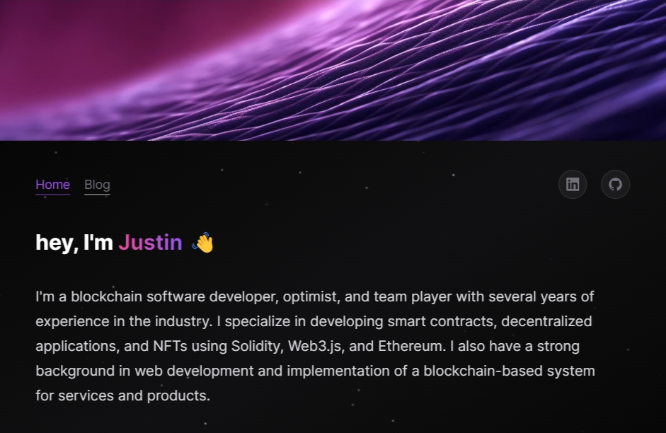

<p align='center'>

</p>

<p align='center'>
<a href='https://justinjdaniel.com'>Website</a> 
| <a href='https://github.com/justinjdaniel'>Github</a> 
| <a href='https://www.linkedin.com/in/justin-j-daniel'>LinkedIn</a> 
<!-- | <a href='...'>Contributing</a> -->
</p>

<p align='center'>
  <a href='LICENSE'></a> 
  <a href='https://nextjs.org/'></a> 
  <a href='repo'></a> 
</p>

<p align='center'>
  <a href="https://github.com/Justinjdaniel/justinjdaniel.com/actions/workflows/build.yml">
    
  </a>
  <a href="vercel-deploy">
    
  </a>
  <a href="https://justinjdaniel.com/">
    
  </a>
</p>

<p align='center'>
  <a href="vscode://https://github.com/Justinjdaniel/justinjdaniel.com">
      
  </a>
  <a href="https://github.com/Justinjdaniel/justinjdaniel.com/codespaces">
      
  </a>
</p>

<hr/>

This repository contains the source code and content for my personal portfolio website. You can view it live at <https://justinjdaniel.com/>.

## Technologies

This project uses [Next.js](next-js), a React framework that enables hybrid static and server rendering, fast refresh, code splitting, built-in CSS support, and more. To learn more about Next.js, you can visit their [documentation](next-js-docs) or [blog](next-js-blog).

It also uses [Tailwind CSS](tailwind-css), a utility-first CSS framework for rapidly building custom designs. Tailwind CSS works by scanning your HTML files, JavaScript components, and any other templates for class names, generating the corresponding styles and then writing them to a static CSS file. It's fast, flexible, and reliable — with zero-runtime. You can read the [installation guide](tailwind-css-installation).

Another key technology in this project is [GSAP](https://greensock.com/gsap/), a professional-grade animation platform for the modern web. GSAP is a robust JavaScript tool-set that turns developers into animation superheroes. It can animate anything JavaScript can touch, in any framework, with blazing speed and cross-browser compatibility. It also offers a variety of plugins for specific animation challenges, such as scroll-based animation, draggable interactions, morphing, and more. You can watch the [screen-casts](https://greensock.com/get-started) or visit the [npm page](https://www.npmjs.com/package/gsap) to learn more about GSAP.

## Running Locally

To run this website locally, you need to have [Git](https://git-scm.com/), [Node.js v16.13+](https://nodejs.org/en/), and [npm](https://www.npmjs.com/) installed on your machine.

- Clone this repository using the following command:

<!-- TODO: add other installation methods -->
<!-- add optional step to install with npm too instead of pnpm only -->
<!-- labels: enhancement -->

```bash
git clone https://github.com/Justinjdaniel/Justinjdaniel.com.git
cd justinjdaniel.com
pnpm install
pnpm dev
```

- Open <http://localhost:3000> in your web browser to view the website.

## License

This project is licensed under the MIT License - see the [LICENSE](license) file for details.

<!-- link reference -->
