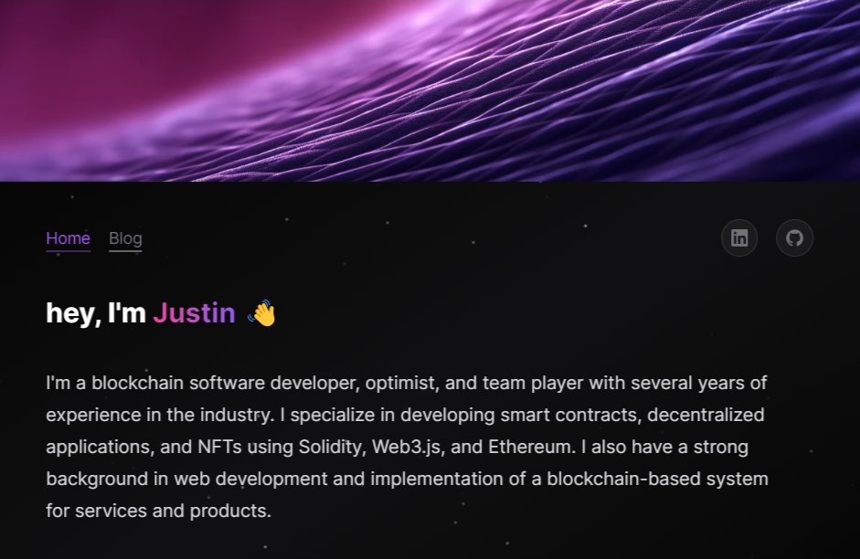

<p align="center">
  
</p>

<h1 align="center">Justin J Daniel</h1>

<p align="center">
  <b>Fullstack Developer & Data Analytics Enthusiast</b><br/>
  <a href="https://justinjdaniel.com">Website</a> •
  <a href="https://github.com/justinjdaniel">GitHub</a> •
  <a href="https://www.linkedin.com/in/justin-j-daniel">LinkedIn</a>
</p>

<p align="center">
  <a href="LICENSE">
    
  </a>
  <a href="https://nextjs.org/">
    
  </a>
  <a href="https://github.com/justinjdaniel/justinjdaniel.com/actions/workflows/build.yml">
    
  </a>
  <a href="https://github.com/justinjdaniel/justinjdaniel.com/actions/workflows/playwright.yml">
    
  </a>
  <a href="https://github.com/justinjdaniel/justinjdaniel.com/actions/workflows/lighthouse.yml">
    
  </a>
  <a href="https://justinjdaniel.com/">
    
  </a>
</p>

---

## 👋 About Me

I'm a full stack developer specializing in blockchain technology, passionate about transforming complex challenges into innovative, forward-thinking solutions. My expertise spans smart contract development, decentralized applications, and robust web platforms, all built with a relentless focus on user experience and real-world impact.

I leverage design thinking, personas, journey mapping, and usability testing to drive data-driven product decisions. From rapid prototyping to high-fidelity wireframing and validation, I ensure every solution is intuitive and effective.

With an agile mindset and startup spirit, I collaborate with teams to deliver products that drive growth and push the limits of web3 and software innovation.

---

## 🚀 Technologies

This portfolio is built using a modern, high-performance web stack. Here is a breakdown of the core technologies:

> [!NOTE]
> ### 💻 Core Frontend & Frameworks
> - **[Next.js 16](https://nextjs.org/):** Leveraging App Router, React Server Components (RSC), and dynamic rendering.
> - **[React 19](https://react.dev/):** Powering modern rendering patterns, concurrent features, and state hooks.
> - **[GSAP](https://greensock.com/gsap/):** Professional-grade JS animation library driving sleek, high-fidelity UI animations.

> [!TIP]
> ### 🎨 Styling & Design
> - **[Tailwind CSS 4](https://tailwindcss.com/):** Utility-first CSS using a modern, high-performance CSS-first setup via `@import "tailwindcss"`.
> - **PostCSS:** Pre-configured modular styles and vendor prefix handling.

> [!IMPORTANT]
> ### 🗄️ Database & Dynamic Features
> - **PostgreSQL / [Neon](https://neon.tech/):** High-performance serverless database for blog features and persistence.
> - **[next-mdx-remote](https://github.com/hashicorp/next-mdx-remote):** Content parsing and syntax-highlighted markdown files with `rehype-pretty-code`.

> [!WARNING]
> ### 🛡️ Tooling, Linting & E2E Testing
> - **[Biome](https://biomejs.dev/):** Lightning-fast toolchain to format, lint, and verify code quality.
> - **[Playwright](https://playwright.dev/):** Bulletproof end-to-end framework for integration and user-journey tests.

---

## 💻 Local Development

Follow these steps to get your local development environment up and running.

### 📋 Prerequisites

> [!IMPORTANT]
> Ensure you have the following installed on your machine:
> - **Git**: Version control to clone the repository.
> - **Node.js**: Version `20.x` or higher (Node.js `22` is recommended).
> - **pnpm**: Version `10.x` or higher for package management.

### 🚀 Setup & Run

1. **Clone the Repository**
   ```bash
   git clone https://github.com/justinjdaniel/justinjdaniel.com.git
   cd justinjdaniel.com
   ```

2. **Install Dependencies**
   ```bash
   pnpm install
   ```

3. **Database Configuration**
   > [!TIP]
   > You can completely bypass Neon/PostgreSQL database requirements for local builds and development!
   > Simply set the environment variable `DATABASE_URL=mock` in your local environment.

   Create a `.env` file in the root directory:
   ```bash
   DATABASE_URL=mock
   ```

4. **Run the Development Server**
   ```bash
   pnpm dev
   ```

5. **Open in Browser**
   Navigate to [http://localhost:3000](http://localhost:3000) to see your local instance.

---

### ⚙️ Developer Tooling & Commands

<details>
<summary><b>🔍 Code Quality & Formatting (Biome)</b></summary>

This project uses [Biome](https://biomejs.dev/) to format and lint code instantly.

```bash
# Check code quality, linting, and formatting
pnpm run check

# Format all files in-place
pnpm run format
```
</details>

<details>
<summary><b>🧪 Running End-to-End Tests (Playwright)</b></summary>

We use Playwright to verify application behavior, layout responsiveness, and full-system correctness.

```bash
# Install Playwright browser binaries
pnpm run test:e2e:install

# Execute end-to-end test suite
pnpm run test:e2e
```
</details>

---

## 📸 Preview

<p align="center">
  
</p>

<!-- ---

## 🌐 Connect

<p align="center">
  <a href="https://justinjdaniel.com">
    
  </a>
  <a href="https://linkedin.com/in/justin-j-daniel">
    
  </a>
  <a href="https://dev.to/justinjdaniel">
    
  </a>
</p> -->

---

> [!NOTE]
> **Source Code & Live Demo**
> This repository contains the source code and content for my personal portfolio website. You can view the live site at [justinjdaniel.com](https://justinjdaniel.com/).
>
> **License**
> This project is open source and licensed under the [MIT License](LICENSE).
